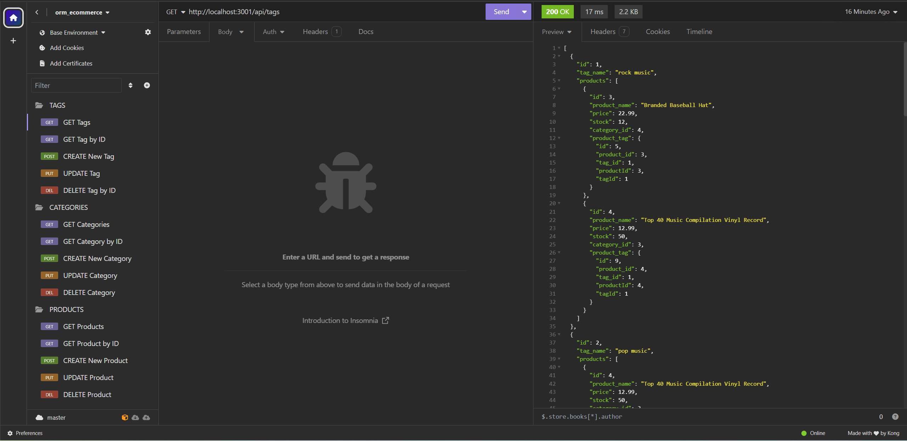

# ORM: E-Commerce Back End

[](https://opensource.org/licenses/MIT)

## Description
This project aims to provide a back end solution for an e-commerce website using the latest technologies. By leveraging technologies such as Express.js and Sequelize, this project offers a scalable and feature-rich solution for managing product data, categories, and tags.

### Problem Solving
This project solves the problem of outdated or inefficient back end systems in the e-commerce industry. By providing a modern and scalable solution, it enables businesses to manage their product data more effectively, leading to improved efficiency and productivity.

### Learning
Through this project, I gained a deeper understanding of Object-Relational Mapping (ORM) concepts, particularly in the context of building back end systems for e-commerce applications. I also enhanced my skills in using technologies such as Express.js, Sequelize, and MySQL to develop robust and scalable APIs.

## Table of Contents
- [Installation](#installation)
- [Usage](#usage)
- [Walkthrough Video](#walkthrough-video)
- [License](#license)
- [Questions](#questions)
- [How To Contribute](#how-to-contribute)

## Installation
To install and run the SVG Logo Maker, follow these steps:

1. Clone the repository to your local machine.
    
    ```git clone git@github.com:jodielee062788/orm_ecommerce.git```

2. Navigate to the project directory.

    ```cd orm_ecommerce```

3. Install dependencies using npm.

    ```npm install```

4. Set up the environment variables by creating a .env file and adding the following variables: DB_NAME, DB_USER & DB_PASSWORD.

5. Run the schema and seed commands to create and seed the database:

    ```source db/schema.sql```

    ```npm run seed```

## Usage
To use this repository, follow these steps:

1. Run the application using npm start

    ```npm start```

2. Test the Endpoints: You can now test the API endpoints using a tool like Insomnia. Here are some example endpoints you can test:

    - GET /api/categories: Retrieve all categories.
    - GET /api/products: Retrieve all products.
    - GET /api/tags: Retrieve all tags.
    - POST /api/categories: Create a new category.
    - POST /api/products: Create a new product.
    - POST /api/tags: Create a new tag.
    - PUT /api/categories/:id: Update a category by ID.
    - PUT /api/products/:id: Update a product by ID.
    - PUT /api/tags/:id: Update a tag by ID.
    - DELETE /api/categories/:id: Delete a category by ID.
    - DELETE /api/products/:id: Delete a product by ID.
    - DELETE /api/tags/:id: Delete a tag by ID.

    

## Walkthrough Video

Here's a walkthrough video on how to run the application [Walkthrough Video](https://drive.google.com/file/d/1SBWkwOT-uEZr31CA1j0GTKQSXcvNwatK/view?usp=sharing). 

## License
This project is licensed under the MIT license. See the [LICENSE](./LICENSE) file for details.

## Questions
For any questions or inquiries, please feel free to reach out to me via email at jodielee062788@gmail.com. 
You can also find me on GitHub: [jodielee062788](https://github.com/jodielee062788)
  
## How To Contribute
If you'd like to contribute to this project, please follow these guidelines:
1. Fork the repository to your GitHub account.
2. Clone the forked repository to your local machine.
3. Create a new branch for your feature or bug fix.
4. Make your changes and commit them with descriptive commit messages.
5. Submit a pull request.
